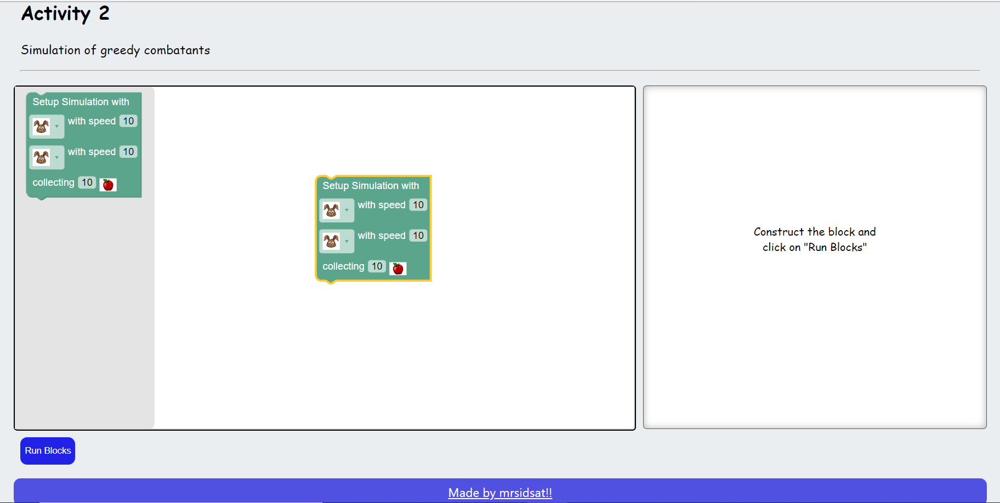
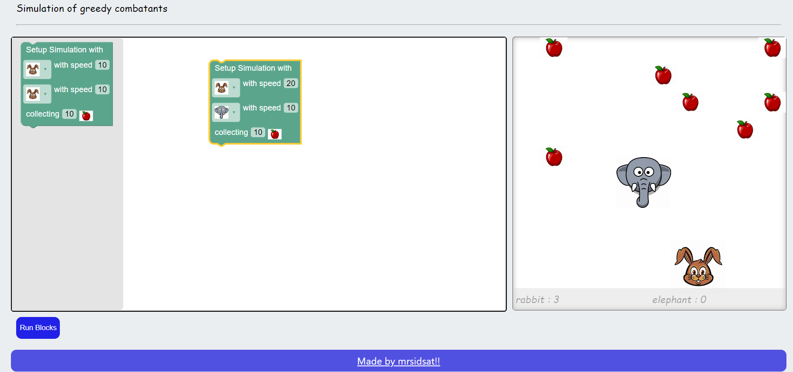

# Block_activity2
Activity generation in blocked code manner. check it out at - https://mrsidsat.github.io/Block_activity2/

This activity can be used to explain and demonstrate the power in code and other programmatic structures accompained with creativity.

Few Examples using the blocks -

  

The whole project is built using JS.

Contributors -  
💻 <a href="https://github.com/mrSidSat">Siddhesh Sathe</a> 
